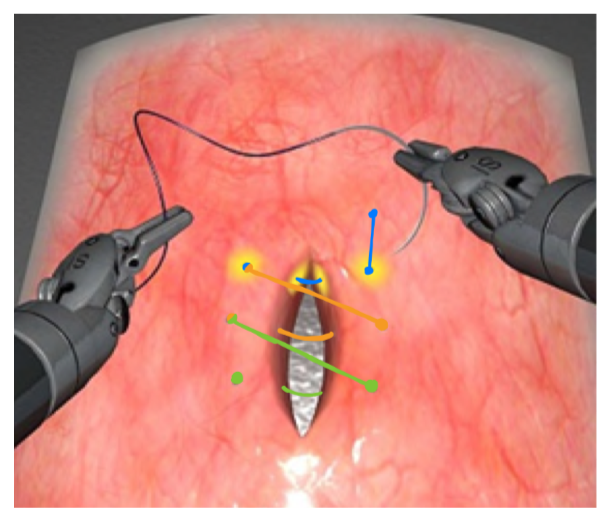

# Manipulation Robotics Labs

This repository contains two lab assignments for the Manipulation Robotics course. Each lab folder includes the problem sheet, the submitted code, and the report.

## Table of Contents

- [Lab 1: Kinematics of DaVinciXi](#lab-1-kinematics-of-davincixi)
  - [Description](#description)
  - [Report](#report1)
- [Lab 2: Dynamics of DaVinciXi](#lab-2-dynamics-of-davincixi)
  - [Description](#description)
  - [Report](#report2)

## Lab 1: Kinematics of DaVinciXi

### Description

This lab focuses on the kinematics of the DaVinciXi robotic system. It involves the implementation of kinematic models using Simulink and MATLAB. The lab folder contains the problem sheet, the submitted code, and the detailed report.

The questions to answer were (as reported in the Project - RMan.pdf inside the LAB1 folder):

1. Draw the Denavit Hartenberg Convention of the DaVinciXi
2. Create a Simulink model for the forward kinematics of the DaVinciXi
3. Solve the closed form solution of the inverse kinematics
4. Create a Simulink model of the Jacobian of the robot
5. Using the Jacobian and direct kinematics, solve the CLIK - closed loop inverse kinematics

### Report
Report is inside the previous folder under RMan_Kinematics.pdf.

Solutions to the above questions can be found inside the `94186_96138_Group5_Code_Report_for_Submission` folder, which contains the code and the report that solved the questions.

## Lab 2: Dynamics of DaVinciXi

### Description

This lab focuses on the dynamics of the DaVinciXi robotic system. It involves the implementation of dynamic models using Simulink and MATLAB. The lab folder contains the problem sheet, the submitted code, and the comprehensive report.

The questions to answer were:

1. Parametrize the DaVinci Xi's dynamics with inertia tensors, centers of mass, and mass.
2. Run either a Newton-Euler or Lagrange-Euler method to compute the dynamics of the DaVinciXi.
3. Calculate the worst-case inertia for each link of the DaVinci. Run a decentralized PID controller.
4. Design and implement a centralized inverse dynamics controller.
5. Choose any trajectory task to run the manipulator with.

For the task, we chose an abdominal suture trajectory.

### Report
Report is inside the previous folder under RMan_Dynamics.pdf.

Solutions to the above questions can be found inside the `Group_5_96138_94186` folder, which contains the code and the report that solved the questions.

### Trajectory Task
The chosen trajectory task for the DaVinciXi manipulator is an abdominal suture task.

